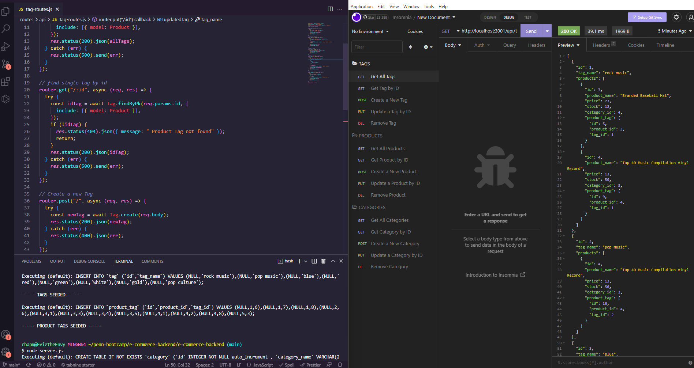

# e-commerce-backend

## Description

Transitioning from Mysql and more into Javascript territory again, we were tasked with utilizing the Sequelize NPM package (Along with Express and Dotenv) to build out a responsive back-end database application for an e-commerce retail store. Given some starter code, I built out all applicable database tables, relationships between said tables, API routes, and testing of all route endpoints using Insomnia. I learned a ton about Sequelize syntax, how to build and solidify the relationships between tables using foreign keys, and furthering modularization to be able to pivot successfully into the next major topic, MVC (Model View Controller). 

## Table of Contents (Optional)

- [Installation](#installation)
- [Usage](#usage)

## Installation

After cloning the repository, you'll need to install dependencies ([mysql2](https://www.npmjs.com/package/mysql2), [dotenv](https://www.npmjs.com/package/dotenv), [Sequelize](https://sequelize.org/) and [Express](https://expressjs.com/) are all mandatory) and have Mysql shell installed to be able to run the initial schema setup. From there, you can "npm run seed" in the terminal to load the mock data and then run "node server.js" to test the applicable routes.

## Usage

Each of the aforementioned routes (To retrieve, update, and delete data from respective tables: category, product, and tag) has been link to localhost so that they can be tested with ease using [Insomnia](https://insomnia.rest/).

Here's a screenshot of the testing process or feel free to check out the walkthrough via [Screencastify](https://watch.screencastify.com/v/yu5KjgoPHrsqBDIjoLnS).

    

## Tests

As mentioned above, all of the API routes can and should be tested via Insomnia. Here's the link again of the [testing](https://watch.screencastify.com/v/yu5KjgoPHrsqBDIjoLnS).
